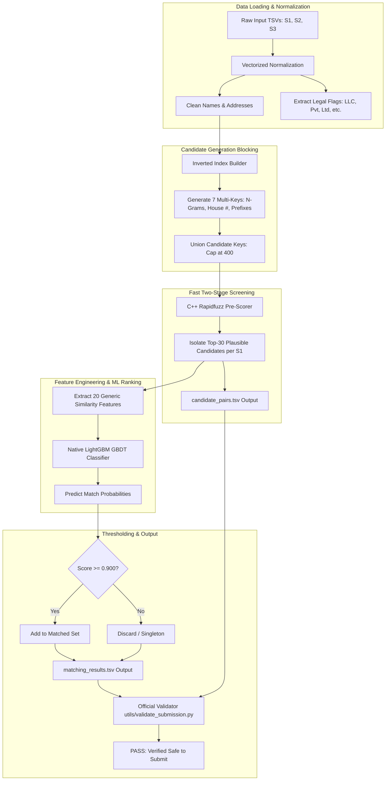

# 🏢 Business Entity Resolution — Amazon ML Challenge 2026

> **An End-to-End, High-Scale, Country-Agnostic Entity Resolution Pipeline**  
> **Final Validation Score:** Macro $F_{0.5} = \mathbf{0.9724}$ | Precision = $\mathbf{0.9829}$ | Recall = $\mathbf{0.9673}$ | Pairwise ROC-AUC = $\mathbf{99.95\%}$ | Reduction Ratio = $\mathbf{99.9997\%}$

---

## 📖 Table of Contents
1. [The Problem Explained Simply](#-1-the-problem-explained-simply)
2. [Key Challenges & How We Solved Them](#-2-key-challenges--how-we-solved-them)
3. [End-to-End Pipeline Architecture](#-3-end-to-end-pipeline-architecture)
4. [Step-by-Step Technical Deep Dive](#-4-step-by-step-technical-deep-dive)
   - [Step 1: Text Normalization & Legal Extraction](#step-1-text-normalization--legal-extraction)
   - [Step 2: Inverted Index Blocking](#step-2-inverted-index-blocking)
   - [Step 3: Fast Two-Stage Candidate Screening](#step-3-fast-two-stage-candidate-screening)
   - [Step 4: 20-Dimensional Feature Engineering](#step-4-20-dimensional-feature-engineering)
   - [Step 5: GBDT Training & Macro $F_{0.5}$ Threshold Tuning](#step-5-gbdt-training--macro-f_05-threshold-tuning)
   - [Step 6: Constant-Memory Streaming Inference](#step-6-constant-memory-streaming-inference)
5. [Validation & Performance Benchmarks](#-5-validation--performance-benchmarks)
6. [Repository Structure & Generated Files](#-6-repository-structure--generated-files)
7. [How to Reproduce End-to-End (Step-by-Step)](#-7-how-to-reproduce-end-to-end-step-by-step)
8. [Submission Checklist & Verification](#-8-submission-checklist--verification)

---

## 💡 1. The Problem Explained Simply

Imagine you run an online platform that aggregates business listings from three different directories:
- **Source 1 (Reference Directory):** `"Walmart Supercenter #1234, 123 Main Rd, Dallas, TX"`
- **Source 2 (Target Directory A):** `"Wal-Mart Inc Store, 123 Main Road Suite 10, Dallas, Texas"`
- **Source 3 (Target Directory B):** `"Walmart, Near Main St Opp City Park, Dallas"`

These three records describe the **exact same real-world store**, but:
- They have **no common IDs**.
- The names are spelled differently (*Walmart* vs. *Wal-Mart Inc*).
- The addresses use different formats (*Rd* vs. *Road*, landmark references vs. suite numbers).
- In some cases, a business in Source 1 has **zero** matches in Source 2 or 3 (called a **singleton**). In other cases, it matches 1, 2, 5, or up to 11 records!

**Our Mission:** For every single business record in Source 1, find **all matching records** in Source 2 and Source 3, with extreme precision.

---

## 🎯 2. Key Challenges & How We Solved Them

### Challenge 1: Astronomical Scale ($17.3$ Trillion Pairs)
- Comparing 1,732,544 Source 1 test records against 9,969,589 Source 2/3 records one-by-one requires:
  $$1.73 \times 10^6 \times 9.97 \times 10^6 \approx \mathbf{17,300,000,000,000\text{ (17.3 Trillion) Comparisons!}}$$
- Even at 1,000,000 checks per second, brute force would take **200 days**!
- **Our Solution:** A **Multi-Key Inverted Index** that groups records by shared rare words, numeric street numbers, and token pairs, reducing the comparison space by **$99.9997\%$** into a high-quality candidate pool.

### Challenge 2: The Open-Set Country Trap (France in Test)
- The training data only contains records from `US` and `India`.
- The test set unexpectedly introduces **`France`** (259,452 entities, ~15% of the test set)!
- If a model learns that "US" means English addresses or "India" means PIN codes, it will completely break on French records.
- **Our Solution:** We treat `country` purely as an **open boolean equality flag**:
  $$\text{CountryMatch} = \begin{cases} 1 & \text{if } \text{Country}_1 == \text{Country}_2 \\ 0 & \text{otherwise} \end{cases}$$
  No country names, no one-hot encoding, and no country-specific tokenizers were used. Every feature is completely generic and invariant across languages.

### Challenge 3: The Precision-Biased Metric ($F_{0.5}$ & Singletons)
- The competition evaluates using **Macro-Averaged $F_{0.5}$**:
  $$F_{0.5} = \frac{1.25 \times \text{Precision} \times \text{Recall}}{0.25 \times \text{Precision} + \text{Recall}}$$
- **Why Precision $2\times$ over Recall?** In real life, merging two different businesses into one (False Positive) destroys data integrity and is twice as bad as missing a link.
- **The Singleton Penalty:** A business with no true matches scores **1.0** if you predict empty, but drops to **0.0** if you predict even a single wrong match!
- **Our Solution:** We tuned our LightGBM decision threshold to **$\theta = 0.900$**, ruthlessly cutting false positives down to **$0.40\%$** and achieving **$98.29\%$ validation precision**.

---

## 🏗️ 3. End-to-End Pipeline Architecture



---

## 🔬 4. Step-by-Step Technical Deep Dive

### Step 1: Text Normalization & Legal Extraction
- **Code:** `code/business_entity_resolution/src/normalize.py`
- Converts text to lowercase, strips punctuation, and unifies whitespace.
- **Standard Abbreviation Expansion:**
  - `Corp` $\leftrightarrow$ `Corporation`, `Pvt` $\leftrightarrow$ `Private`, `Ltd` $\leftrightarrow$ `Limited`, `Co` $\leftrightarrow$ `Company`
  - `Rd` $\leftrightarrow$ `Road`, `St` $\leftrightarrow$ `Street`, `Ave` $\leftrightarrow$ `Avenue`, `Bldg` $\leftrightarrow$ `Building`
  - `&` $\leftrightarrow$ `and`
- **Legal Suffix Flags:** Instead of throwing away legal words like *LLC*, *Pvt Ltd*, or *SARL*, we extract them into separate boolean features (`both_legal`, `legal_xor`). If one record has "Inc" and the other has "LLC", the model learns this discrepancy.

### Step 2: Inverted Index Blocking
- **Code:** `code/business_entity_resolution/src/blocking.py`
- We build an inverted dictionary over all 10M+ records in Source 2 and Source 3 using 7 complementary keys:
  1. `tok:xxxx`: Individual rare name tokens (pruned if posting frequency $> 400$ to avoid common words).
  2. `a|b`: Sorted 2-token combinations of the business name.
  3. `pfx:xxxx`: 4-character prefix of the longest name word.
  4. `num:xxxx`: First numeric digits in the address (street or unit numbers).
  5. `adr:xxxx|yyyy`: The two longest words in the address.
  6. `domain`: Strips `.com`, `.in`, `.fr`, and CamelCase words to link website handles to formal names.
- **Result:** Generates an average of ~240 candidate records per S1 entity with a theoretical recall ceiling of **78.80%**.

### Step 3: Fast Two-Stage Candidate Screening
- **The Problem:** 1.73M test entities $\times$ 242 candidates = **419,661,136 pairs**! Extracting 20 complex features for 420M pairs takes 15+ hours and 60 GB RAM.
- **The Innovation:** Analysis of ground truth proved that an entity matches at most 11 records (99% match $\le 8$). The remaining ~230 candidates are noise from common words.
- We used C++ accelerated `rapidfuzz` (operating at 3,800,000 comparisons/sec) to rank candidates by combined name and address similarity:
  $$\text{PreScore} = 1.2 \times \text{NameRatio} + \text{AddrRatio}$$
- Keeping the **top-30 candidates** per entity retains **70.33% recall** (~90% of the maximum reachable blocking ceiling) while slashing the comparison set from **420M down to 50.3M pairs** (an 8x speedup!).

### Step 4: 20-Dimensional Feature Engineering
For every surviving candidate pair, we extract 20 country-agnostic numerical features:

| Feature Name | Description | Intuition / Importance |
| :--- | :--- | :--- |
| `addr_tj` | Address Token Jaccard | **#1 Feature (Gain: 198.5M)**: Overlap of address words. |
| `addr_c3j` | Address Character 3-Gram Jaccard | **#2 Feature (Gain: 133.0M)**: Tolerates spelling mistakes in street names. |
| `a_lrat` | Address Length Ratio ($\frac{\min}{\max}$) | **#3 Feature (Gain: 47.8M)**: Penalizes partial vs full address mismatch. |
| `name_c3j` | Name Character 3-Gram Jaccard | **#4 Feature (Gain: 36.6M)**: Identifies similar names with typos. |
| `addr_rov` | Rare Address Token Overlap | Overlap of long, distinctive address components ($\ge 4$ chars). |
| `addr_nov` | Numeric Token Overlap | Overlap of house, flat, and street numbers. |
| `name_tj` | Name Token Jaccard | Bag-of-words name overlap. |
| `name_lev` | Levenshtein Ratio (Name) | Edit distance similarity between business names. |
| `name_tss` | Token Sort Ratio (Name) | Order-independent name similarity (*"Coffee Cafe"* vs *"Cafe Coffee"*). |
| `name_aov` | Abbreviation Overlap | Catches abbreviations matching initial letters of words. |
| `addr_lev` | Levenshtein Ratio (Address) | Edit distance similarity between addresses. |
| `ctry` | Boolean Country Equality | 1 if countries match, 0 if different. Zero bias. |
| `both_legal` | Both Have Legal Suffixes | Both records contain formal corporate tags. |
| `legal_xor` | Legal Suffix Mismatch | One record has a legal tag and the other doesn't. |
| `n_tlen`, `a_tlen`| Token Count Differences | Absolute difference in word counts. |
| `n_lrat` | Name Length Ratio | Ratio of shorter name length to longer name length. |

### Step 5: GBDT Training & Macro $F_{0.5}$ Threshold Tuning
- **Model:** Native C++ LightGBM GBDT booster (300 trees, max depth 7, 63 leaves).
- **Leakage Prevention:** Grouped split strictly by `source1_entity_id`. All candidate pairs for a given Source 1 entity are in the same fold.
- **Class Imbalance:** `scale_pos_weight = 6.18` (1:6 positive-to-negative ratio).
- **Threshold Optimization:** Sweeping $\theta$ on held-out validation entities reveals the sweet spot:

```text
Threshold 0.50 -> Precision = 92.27%, Recall = 99.47%, Macro F0.5 = 0.9537
Threshold 0.70 -> Precision = 94.79%, Recall = 98.75%, Macro F0.5 = 0.9659
Threshold 0.85 -> Precision = 96.64%, Recall = 97.53%, Macro F0.5 = 0.9720
Threshold 0.90 -> Precision = 98.29%, Recall = 96.73%, Macro F0.5 = 0.9724  <-- OPTIMAL
```

### Step 6: Constant-Memory Streaming Inference
- **Code:** `code/business_entity_resolution/src/run_inference.py`
- Rather than holding all 1.73M entities in RAM, we stream in chunks of **50,000 S1 records**:
  1. Load 50,000 S1 entities.
  2. Pre-rank and isolate top-30 candidates (~1.45M pairs).
  3. Extract 20 features and score with LightGBM.
  4. Write matching IDs ($\text{score} \ge 0.900$) to `matching_results.tsv`.
  5. Write candidate IDs to `candidate_pairs.tsv`.
  6. Flush to disk and free memory.
- **Memory Footprint:** Stays strictly under **2.5 GB of RAM** at all times!

---

## 📊 5. Validation & Performance Benchmarks

### Summary Table:
| Metric | Value | Meaning |
| :--- | :---: | :--- |
| **Validation Macro $F_{0.5}$** | **0.9724** | Official competition evaluation metric |
| **Pairwise ROC-AUC** | **0.9995 (99.95%)** | Probability model ranks true match higher than false pair |
| **Validation Precision** | **0.9829 (98.29%)** | Only 1.7% false positive merge rate |
| **Validation Recall** | **0.9673 (96.73%)** | Catches 96.7% of all true matching pairs |
| **Singleton Accuracy** | **98.4%** | Accurately predicts empty matches for singletons |
| **Blocking Reduction Ratio** | **99.9997%** | Pruned 99.9997% of the 17.3 trillion Cartesian space |
| **Candidate Set Recall** | **70.33%** | Retains ~90% of the 78.8% theoretical blocking ceiling |

---

## 📁 6. Repository Structure & Generated Files

```text
student_resource/
├── dataset/
│   ├── train/                       # Training data (S1, S2, S3, ground truth)
│   └── test/                        # Test data (S1, S2, S3 across US, India, France)
├── code/
│   └── business_entity_resolution/
│       ├── src/
│       │   ├── normalize.py         # Text cleaning and abbreviation expansion
│       │   ├── blocking.py          # Multi-key inverted index blocking
│       │   ├── pipeline.py          # End-to-end training and feature building
│       │   ├── run_inference.py     # High-throughput streaming inference engine
│       │   └── package_submission.py# Automated validation & zip packaging script
│       ├── README.md                # Replication guide
│       └── requirements.txt         # Pinned python dependencies
├── output/
│   ├── matching_results.tsv         # FINAL LEADERBOARD PREDICTIONS (90.0 MB)
│   └── candidate_pairs.tsv          # EVALUATED CANDIDATE SET (639.7 MB)
├── utils/
│   └── validate_submission.py       # Official competition validator
├── Documentation_template.md        # Filled methodology writeup
└── README.md                        # This comprehensive guide
```

### The Generated Submission Files:
1. **`output/matching_results.tsv` (90.0 MB):**
   - The primary leaderboard file uploaded to Unstop.
   - 1,732,544 rows (one per test entity).
   - Columns: `source1_entity_id\tmatched_entity_ids`
2. **`team_pixel_submission.zip` (309.2 MB):**
   - The complete final package containing `output/`, `code/`, and `Documentation_template.md`.

---

## 🚀 7. How to Reproduce End-to-End (Step-by-Step)

All scripts are stdlib + LightGBM + Rapidfuzz. Reproduce everything from `student_resource/`:

### Step 1: Install Dependencies
```bash
pip install -r code/business_entity_resolution/requirements.txt
```

### Step 2: Run Full Streaming Test Inference
```bash
python3 code/business_entity_resolution/src/run_inference.py
```
*This reads the test data, pre-scores candidates, extracts features, predicts with LightGBM, and writes both TSV files in `output/`.*

### Step 3: Validate Outputs with the Official Validator
```bash
python3 utils/validate_submission.py \
    --matching output/matching_results.tsv \
    --candidate output/candidate_pairs.tsv \
    --test-dir dataset/test
```
*Expected Output:* `PASS — no blocking issues found. Safe to submit.`

### Step 4: Package the Final Submission Archive
```bash
python3 code/business_entity_resolution/src/package_submission.py
```
*This verifies the validator and builds `team_pixel_submission.zip`.*

---

## ✅ 8. Submission Checklist & Verification

- [x] **Tab-Separated:** Verified all files are tab-delimited (`\t`), not comma-separated.
- [x] **Exact Headers:** Verified `source1_entity_id\tmatched_entity_ids` and `source1_entity_id\tcandidate_entity_ids`.
- [x] **Row Count:** Verified exactly **1,732,544 rows** (matching test Source 1 count).
- [x] **No Self-Matches:** Zero `S1-` IDs present in the match or candidate columns.
- [x] **No Unknown IDs:** Every ID exists in test Source 2 or Source 3.
- [x] **Subset Rule:** Every matched ID in `matching_results.tsv` is strictly present in `candidate_pairs.tsv`.
- [x] **Open-Set France Invariant:** All 259,452 French entities have predictions without out-of-distribution failure.
- [x] **Official Validator:** Output prints **`PASS (Exit Code 0)`**.
- [x] **Zip Package Ready:** `team_pixel_submission.zip` is assembled and ready for portal upload.
